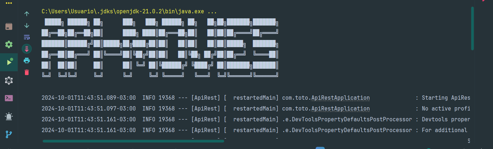
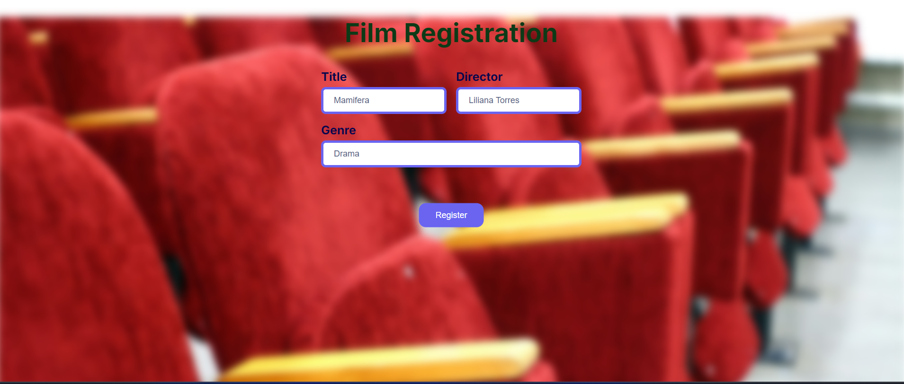
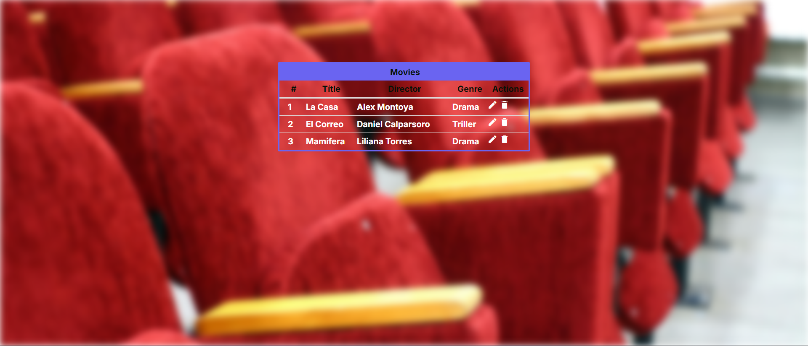
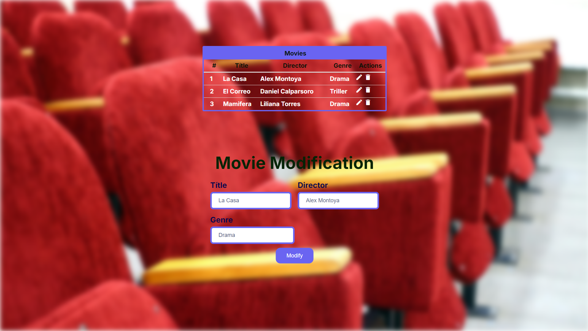
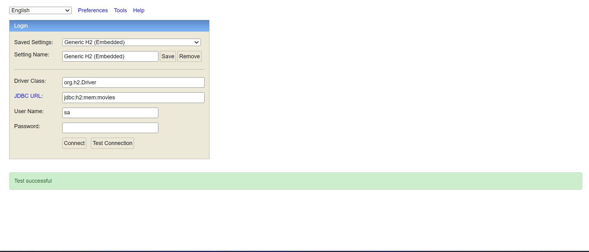
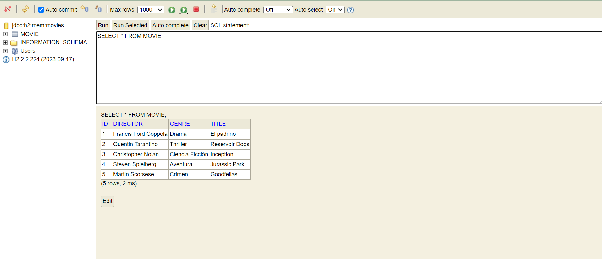

                                                                 
 <h1 aling="center"> API de Películas  🎥</h1>

___


&nbsp;&nbsp;&nbsp;&nbsp;&nbsp;&nbsp;&nbsp;&nbsp;&nbsp;[](LICENSE)&nbsp;&nbsp;&nbsp;[](https://GitHub.com/toby959/conversor-toby959/watchers/)
___
# Descripcion 📖
Este proyecto es una API simple que une el backend con el frontend.
___
# Recursos:

| Plugin          | URL                                                                |
|-----------------|--------------------------------------------------------------------|
| spring-boot-starter-data-jpa            | https://start.spring.io/           |
| spring-boot-starter-web          | https://start.spring.io/ | 
 |spring-boot-devtools | https://start.spring.io/ |
| com.h2database | https://start.spring.io/                               |

# Herramientas utilizadas 🛠️
___
* 1 - IntelliJ IDEA Community Edition.
* 2 - Java version 17.0.10.
___   
# Ejecutar el Proyecto ⚙️
1 - Clona el repositorio en tu máquina local
``` bash
git clone
<https://github.com/toby959/api-peli.git>
``` 
2 - Compila y ejecuta el archivo Main.java.
___   
# Funcionalidades 📦
* Se pueden cargar películas con su título y genero.
* Interfaz de Usuario: Ofrece una interfaz simple y amigable utilizando el frontend, realizado con html; css y js.
* El frontend, permite ingresar Películas y abrir otra ventana donde se listan todas las peliculas, se pueden modificar o borrar. Cuando se modifican, se muestra una ventana emergente, debajo de la actual, donde se permite modificar los datos, luego se oculta esta ventana.
___   
# Imagenes 📸  












___   

# Colaboraciones 🎯
Si deseas contribuir a este proyecto, por favor sigue estos pasos:

1 - Haz un fork del repositorio: Crea una copia del repositorio en tu cuenta de GitHub.  
2 - Crea una nueva rama: Utiliza el siguiente comando para crear y cambiar a una nueva rama:
```bash
git chechout -b feature-nueva
```
3 - Realiza tus cambios: Implementa las mejoras o funcionalidades que deseas agregar.  
4 - Haz un commit de tus cambios: Guarda tus cambios con un mensaje descriptivo:
```bash 
git commit -m 'Añadir nueva funcionalidad'
```
5 - Envía tus cambios: Sube tu rama al repositorio remoto:
````bash
git push origin feature-nueva
````
6 - Abre un pull request: Dirígete a la página del repositorio original y crea un pull request para que revisemos tus cambios.

Gracias por tu interés en contribuir a este proyecto. ¡Esperamos tus aportes!
___

## Licencia 📜

Este proyecto está licenciado bajo la Licencia MIT - ver el archivo [LICENSE](https://github.com/toby959/api-peli/blob/main/LICENSE) para más detalles.
